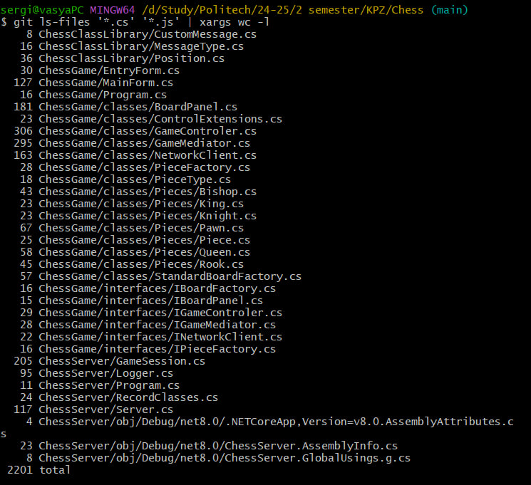
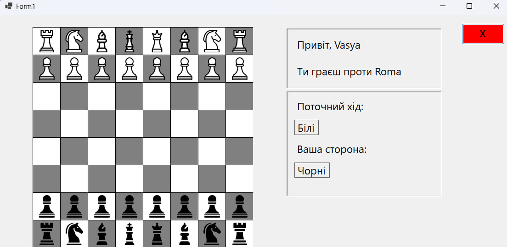
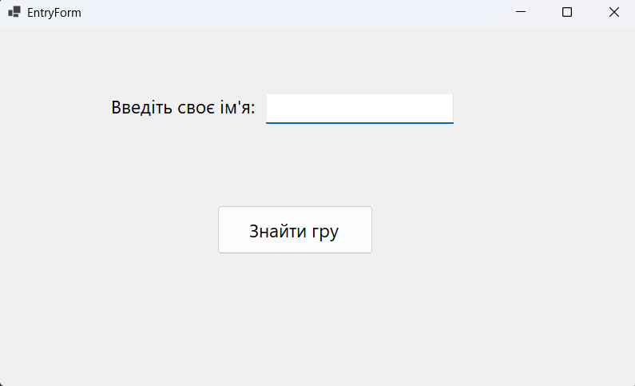
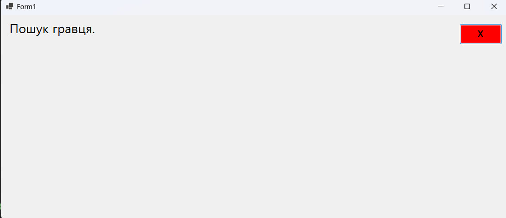
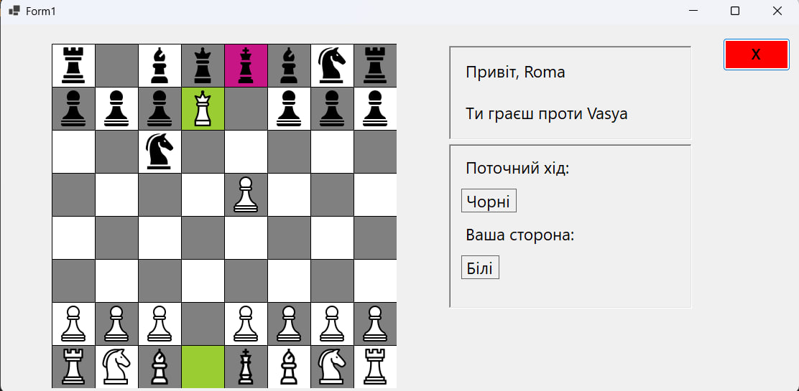

# ♟️ Chess Game

A console-based server and Windows Forms client for a two-player chess game over a local network. The project supports multiple concurrent game sessions with logging and move history saved in JSON files.

## 🔢 Lines of Code

- **Number of lines of code**:
  

## 📦 Contents

- **ChessClassLibrary/**: Shared classes including `Position`, `MoveRecord`, `GameHistoryRecord`, and more.
- **ChessServer/**: Console-based server application that handles multiple parallel chess games.
- **ChessClient/**: Windows Forms client application for playing chess with a graphical interface.

## 🚀 Getting Started

### Requirements

- **.NET 8.0 SDK** or newer
- **Windows** (Windows Forms is supported only on Windows)
- **IDE**: Visual Studio or VS Code (Visual Studio recommended)

### Setup and Running Locally

1. **Clone the Repository**

   ```bash
   git clone https://github.com/ipzk241-svm/Chess.git
   cd Chess
   ```

2. **Run the Server**

   - Open `ChessServer/ChessServer.csproj` in Visual Studio or VS Code.
   - Start the project by pressing `F5` or running the following command in the terminal:
     ```bash
     dotnet run --project ChessServer/ChessServer.csproj
     ```
   - The server will listen on port `5000` by default (configurable in the code).

3. **Run the Clients**

   - Open `ChessClient/ChessClient.csproj` in two separate instances of Visual Studio or VS Code.
   - Start two client instances by pressing `F5` or running:
     ```bash
     dotnet run --project ChessClient/ChessClient.csproj
     ```
   - In each client:
     - Enter a player name.
     - Press 'Find game' to connect to the server.
   - Once both clients connect, the game will start.

## ✨ Features

- **Two-Player Network Play**: Connect two players over a local network or the Internet using a TCP-based server, with support for joining, moving, and leaving games.
- **Graphical Chess Interface**: A Windows Forms-based client with a chessboard that highlights selected pieces, valid moves, check, and the last move, plus rotation for black players.
- **Robust Chess Logic**: Full chess rules implementation, including move validation, check detection, checkmate, and stalemate, managed by a singleton game controller.
- **Game History Storage**: Saves game details (player names, sides, and move history with coordinates and timestamps) in JSON files in the `GameHistory/` directory.
- **Responsive UI**: Displays player names, sides (white/black), current turn, and opponent status, with a loading animation during matchmaking.
- **Error Handling**: Graceful handling of network errors, opponent disconnections, and invalid moves, with user-friendly error messages.
- **Asynchronous Networking**: Uses asynchronous message handling for smooth communication between clients and the server.

## 📸 Screenshots

- **Chess Board**:
  

- **Entry Form**:
  

- **Loading Animation**:
  

- **Active game**:
  

## 📂 Game History

After a game ends, the move history is saved in the `GameHistory/` directory as JSON files. Each file contains:

- Player names
- Player sides (white or black)
- List of moves with coordinates, timestamps, and the side that made the move

## 🛠️ Configuration

- **Server Port**: The default port is `9000`. To change it, modify the port number in the server code (`ChessServer` project).
- **ClientConnection**: For now client connection is hardcoded but in the future will be fixed. To change it, modify the connection string in the client code (`ChessGame` project).

## 🛠️ Design Patterns

The project employs several design patterns to ensure modularity, maintainability, and scalability:

- **Singleton**:

  - **Used in**: `GameControler` class.
  - **Purpose**: Ensures a single instance of the game controller manages the chessboard, turn state, and king positions across the client application, preventing state inconsistencies.
  - **Implementation**: A private constructor and a static `Instance` property provide global access to the game state.

- **Factory Method**:

  - **Used in**: `PieceFactory` and `StandardBoardFactory` classes.
  - **Purpose**: Encapsulates the creation of chess pieces (`Pawn`, `Rook`, `Knight`, `Bishop`, `Queen`, `King`), allowing the `GameControler` to initialize the game without directly instantiating piece classes or board setups.
  - **Implementation**: `PieceFactory's` `CreatePiece` method returns a piece based on the `PieceType` enum, while `StandardBoardFactory's` `CreateInitialBoard` sets up the standard chessboard layout using `PieceFactory`, simplifying piece and board creation and enabling future extensions (e.g., custom board setups).

- **Mediator**:

  - **Used in**: `GameMediator` class.
  - **Purpose**: Reduces coupling between the game logic (`IGameControler`), UI (`IBoardPanel`), and network (`INetworkClient`) by coordinating their interactions, such as handling moves and board updates.
  - **Implementation**: Centralizes logic for move validation, piece selection, and network communication, ensuring seamless integration of components.

- **Builder**:

  - **Used in**: `Logger` class.
  - **Purpose**: Provides a flexible way to configure the server logger’s file path, console output, and minimum log level without overloading the constructor.
  - **Implementation**: The `LoggerBuilder` class allows step-by-step configuration before creating a `Logger` instance, improving configurability.

- **Observer**:

  - **Used in**: `GameControler`, `NetworkClient`, and `MainForm`.
  - **Purpose**: Enables components to react to events like turn changes, opponent connections, or disconnections without tight coupling.
  - **Implementation**: Events like `OnSideChanged` (in `GameControler`) and `OpponentNameReceived`, `MoveReceived`, `DisconnectAction` (in `NetworkClient`) notify subscribers to update the UI or game state.

  ## 🧩 Programming Principles

The project adheres to several programming principles to ensure clean, maintainable, and efficient code:

- **SOLID**:

  - **Single Responsibility Principle (SRP)**: Each class has a single responsibility, e.g., `GameControler` manages game logic, `BoardPanel` handles UI rendering, and `NetworkClient` deals with network communication.
  - **Open/Closed Principle (OCP)**: Classes like `Piece` are extensible (new piece types can be added) without modifying existing code, and interfaces (`IGameControler`, `IPieceFactory`) allow swapping implementations.
  - **Liskov Substitution Principle (LSP)**: Derived classes (`King`, `Queen`) can replace `Piece` without breaking functionality, ensuring consistent move validation.
  - **Interface Segregation Principle (ISP)**: Interfaces are specific (e.g., `IBoardPanel` only defines UI-related methods), avoiding unnecessary method implementations.
  - **Dependency Inversion Principle (DIP)**: High-level modules depend on abstractions (e.g., `GameMediator` uses `IGameControler`, `StandardBoardFactory` uses `IPieceFactory`), enhancing flexibility.

- **DRY (Don't Repeat Yourself)**:

  - Code duplication is minimized by centralizing piece creation in `PieceFactory`, board initialization in `StandardBoardFactory`, and logging in `Logger`, ensuring reusable and maintainable code.

- **KISS (Keep It Simple, Stupid)**:

  - The design is straightforward: classes have clear roles, move validation in `Piece` is minimal, and the server uses a simple queue for matchmaking, avoiding unnecessary complexity.

- **YAGNI (You Aren't Gonna Need It)**:
  - Only essential features are implemented (e.g., standard chess rules, network play, game history), avoiding speculative functionality like advanced chess variants or unused logging features.

## 🔄 Refactoring Techniques

The project incorporates several refactoring techniques to improve code structure, readability, and maintainability:

- **Extract Method**:

  - **Used in**: `GameControler` (e.g., `IsKingInCheck`, `IsSquareUnderAttack`), `BoardPanel` (e.g., `DrawCellBackground`).
  - **Purpose**: Breaks down complex methods into smaller, reusable ones, improving readability and testability.
  - **Example**: `IsSquareUnderAttack` in `GameControler` isolates logic for checking if a position is under attack, used in multiple methods.

- **Replace Conditional with Polymorphism**:

  - **Used in**: `Piece` and its derived classes (`King`, `Queen`, etc.).
  - **Purpose**: Eliminates conditional logic for move validation by delegating behavior to specific piece classes, enhancing extensibility.
  - **Example**: Each piece type implements `IsValidMove` differently, avoiding a large `switch` statement in a single method.

- **Extract Class**:

  - **Used in**: `PieceFactory`, `StandardBoardFactory`, `Logger`, `GameMediator`.
  - **Purpose**: Moves related functionality into dedicated classes to reduce complexity and adhere to the Single Responsibility Principle.
  - **Example**: `StandardBoardFactory` extracts board initialization logic from `GameControler`, making the controller more focused.

- **Move Method**:

  - **Used in**: `GameControler` to `StandardBoardFactory`, `NetworkClient`, `GameMediator`.
  - **Purpose**: Relocates methods to classes where they logically belong, improving cohesion.
  - **Example**: Board initialization moved from `GameControler.InitializeBoard` to `StandardBoardFactory.CreateInitialBoard`.

- **Introduce Parameter Object**:

  - **Used in**: `Position` structure across multiple classes.
  - **Purpose**: Replaces multiple parameters (e.g., X and Y coordinates) with a single object, simplifying method signatures and improving semantics.
  - **Example**: `MovePieceFromNetwork` in `GameControler` uses `Position` instead of separate `int` coordinates.

- **Replace Magic Numbers with Named Constants**:

  - **Used in**: `GameControler` (e.g., `BoardSize`), `BoardPanel` (e.g., `cellSize`).
  - **Purpose**: Replaces hard-coded numbers with named constants, enhancing readability and maintainability.
  - **Example**: `BoardSize = 8` in `GameControler` replaces the magic number 8 for board dimensions.

- **Rename Method/Variable**:
- **Used in**: Various classes (e.g., `GameControler`, `NetworkClient`, `BoardPanel`).
  - **Purpose**: Improves code readability and self-documentation by using meaningful names, reducing the need for comments.
  - **Example**: ListenForMoves in NetworkClient clearly indicates asynchronous message listening, and MoveReceived event describes its purpose.
